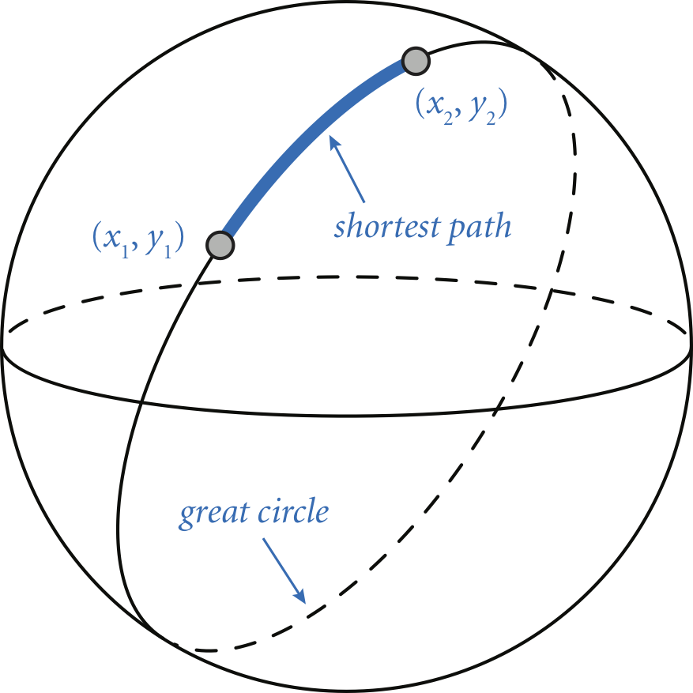

# Java Programming Assignments

This repository contains solutions to four introductory Java programming assignments that cover fundamental concepts including command-line arguments, mathematical operations, and type conversions.

## Program 1: HelloGoodbye

### Description
A simple program that takes two names as command-line arguments and prints hello and goodbye messages.

### Usage
```bash
javac HelloGoodbye.java
java HelloGoodbye Kevin Bob
```

### Example Output
```
Hello Kevin and Bob.
Goodbye Bob and Kevin.
```

### Concepts
- Command-line arguments
- String manipulation
- Basic output

## Program 2: RightTriangle

### Description
Determines if three given integers can be the sides of a right triangle.

### Usage
```bash
javac RightTriangle.java
java RightTriangle 3 4 5
```

### Example Output
```
true
```

### Concepts
- Integer operations
- Boolean logic
- Pythagorean theorem
- Input validation


## Program 3: GreatCircle

### Description
Calculates the great-circle distance between two points on Earth using their latitude and longitude.

### Usage
```bash
javac GreatCircle.java
java GreatCircle 40.35 74.65 48.87 -2.33  # Princeton to Paris
```

### Example Output
```
5902.927099258561 kilometers
```

### Concepts
- Floating-point arithmetic
- Math library functions
- Trigonometric calculations
- Degree/radian conversion



## Program 4: CMYKtoRGB

### Description
Converts color values from CMYK (Cyan, Magenta, Yellow, Black) format to RGB (Red, Green, Blue) format.

### Usage
```bash
javac CMYKtoRGB.java
java CMYKtoRGB 0.0 1.0 0.0 0.0  # magenta
```

### Example Output
```
red   = 255
green = 0
blue  = 255
```

### Concepts
- Type conversion
- Color space transformations
- Floating-point to integer conversion
- Mathematical formulas implementation

## Common Requirements
- All programs use only java.lang library functions
- No loops or conditionals (per assignment constraints)
- Strict adherence to specified input/output formats

## Getting Started
1. Install Java programming environment
2. Clone this repository
3. Compile each program with `javac`
4. Run with appropriate command-line arguments

## License
This project is open-source under the [MIT License](LICENSE).
